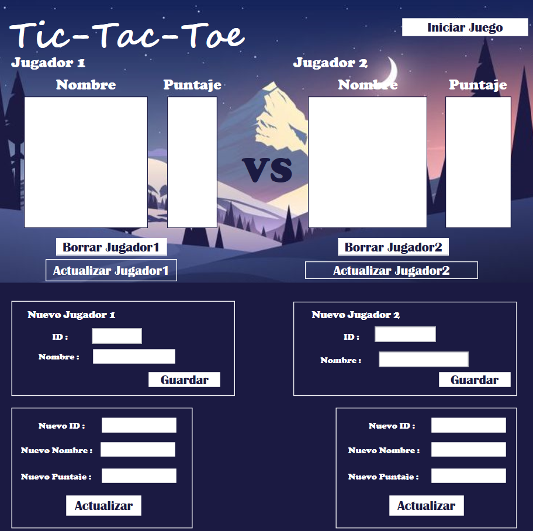

# tic_tac_toe
Creación del juego Tic Tac Toe en lenguaje C# conectado a una base de datos SQL Server como práctica de la materia Programación Orientada a Entornos Virtuales.

### CRUD:
El objetivo de la práctica es conectar una base de datos en SQL Server para guardar los datos de cada jugador: nombre y puntaje, así como poder actualizarlos, o eliminar al jugador. Se selecciona al jugador para pasar al juego con el botón `iniciar juego`.

.
.

### TIC TAT TOE
Antes de comenzar el juego, se seleccionan ambos jugadores, como requisito estos deben estar guardados en la base de datos. El primer jugador selecciona si desea jugar con **X** u **O**, al segundo jugador se le asigna el opuesto al que anteriormente selecciono el jugador 1. El juego comienza por turnos, y al ganador se le acumulan los puntos en la base de datos, en caso de ser empate, no se otorga ningún punto.

.
